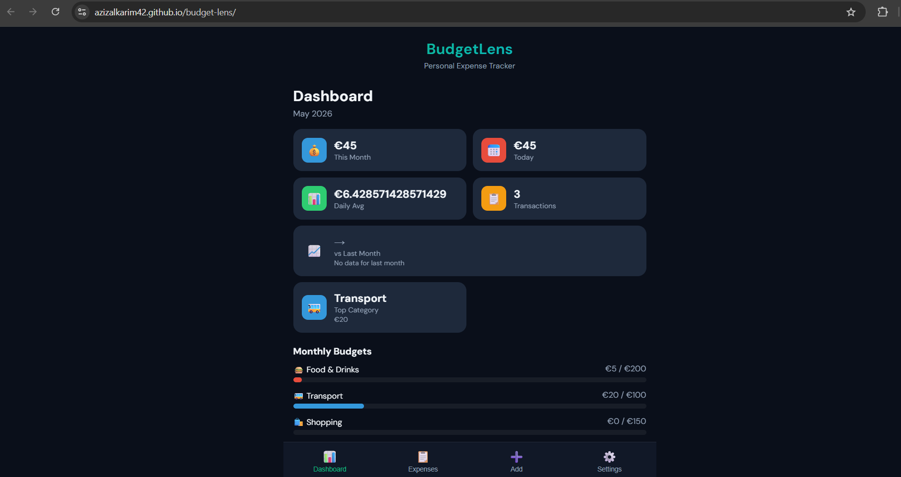
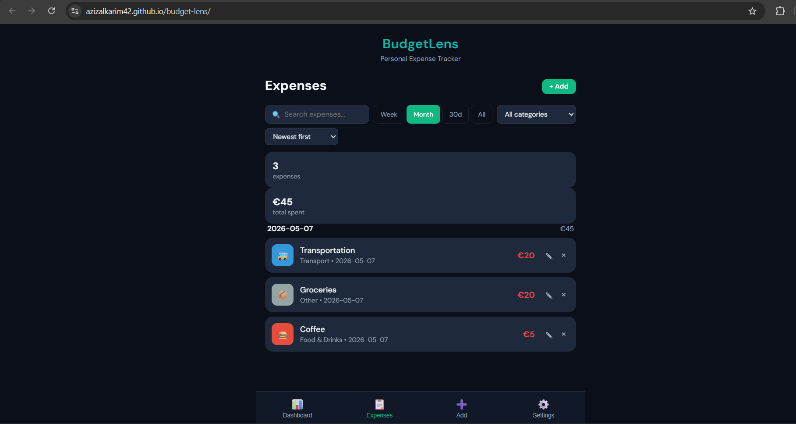
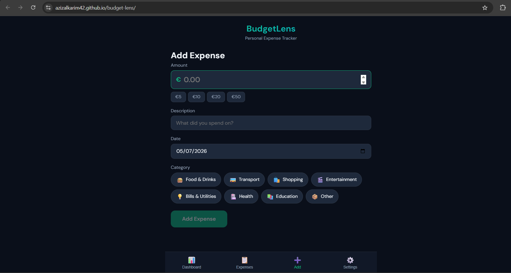

# BudgetLens — Personal Expense Tracker

A client-side web application for tracking personal expenses with category-based budgeting and visual analytics. Built entirely in **F#** using [Fable](https://fable.io/) (F# → JavaScript compiler) and [Feliz](https://github.com/Zaid-Ajaj/Feliz) (React bindings).

## Try it Live

👉 **[https://azizalkarim42.github.io/budget-lens/](https://azizalkarim42.github.io/budget-lens/)**

## Screenshots





## Motivation

Keeping track of daily spending is one of the most effective ways to improve personal finances, yet most budgeting apps require accounts, subscriptions, or complex setups. BudgetLens solves this by providing an **instant, private, offline-capable** expense tracker that runs entirely in the browser with no backend or sign-up required.

## Features

- **Dashboard** — Monthly overview with spending cards, daily bar chart (last 14 days), and per-category horizontal bar chart.
- **Budget Tracking** — Set optional monthly budgets per category with visual progress bars and overspend alerts.
- **Expense Management** — Add, edit, and delete expenses with quick-amount buttons, date picker, and category chips.
- **Smart Filtering** — Filter by time range (week/month/30 days/all), category, and free-text search. Sort by date or amount.
- **Category System** — 8 default categories with emoji icons, custom colors, and optional budgets. Fully customizable.
- **Multi-Currency** — Support for EUR, USD, GBP, and HUF with proper formatting.
- **Persistent Storage** — All data saved in `localStorage`; no account or server needed.
- **Responsive Design** — Mobile-first dark theme with bottom tab navigation.

## Tech Stack

| Layer | Technology |
|-------|------------|
| Language | F# 8.0 |
| Compiler | Fable 4.x (F# → JavaScript) |
| UI Library | Feliz 2.x (React bindings) |
| Serialization | Thoth.Json |
| Bundler | Vite |
| Hosting | GitHub Pages |

## Architecture

The app follows the **Elm Architecture** (Model-View-Update):

- **`Types.fs`** — Domain types (`Category`, `Expense`, `Currency`, `Model`, `Msg`) and formatting helpers
- **`Storage.fs`** — `localStorage` persistence with Thoth.Json encoders/decoders
- **`Dashboard.fs`** — Dashboard view with stat cards, daily chart, category chart, and budget progress
- **`ExpenseForm.fs`** — Add/edit expense form with category chip selector and quick amounts
- **`ExpenseList.fs`** — Expense list with filtering (time range, category, search) and sorting
- **`CategoryManager.fs`** — Category CRUD, icon picker, currency selector, and data management
- **`App.fs`** — Root init/update/view functions and tab navigation
- **`Main.fs`** — React entry point

## Prerequisites

- [.NET 8 SDK](https://dotnet.microsoft.com/download/dotnet/8.0)
- [Node.js 18+](https://nodejs.org/)

## Build & Run

```bash
# Clone the repository
git clone https://github.com/azizalkarim42/budget-lens.git
cd budget-lens

# Restore .NET tools (Fable compiler)
dotnet tool restore

# Restore NuGet packages
dotnet restore src

# Install npm dependencies
npm install

# Start dev server (Fable watch + Vite)
npm start
```

The app will open at `http://localhost:5173`.

## Production Build

```bash
npm run build
```

Output is in the `dist/` folder.

## License

MIT
